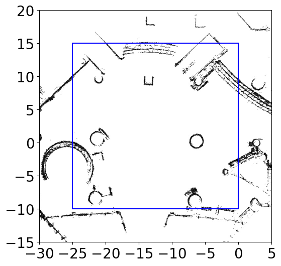
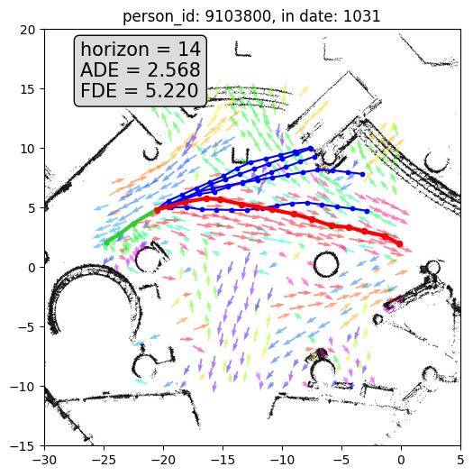

# LaCE-LHMP

## Data
Use first 10 days of [ATC dataset](https://dil.atr.jp/crest2010_HRI/ATC_dataset/), first day for train and the rest for evaluation. The data is in `atc_data/middle_area` folder.

Use middle area of ATC dataset. This middle area has dimensions where x ranges from -25m to 0m and y ranges from -10m to 15m, amounting to an area of 625m<sup>2</sup>, which is shown in the figure below.



## Baseline
Use [CLiFF-LHMP](https://ieeexplore.ieee.org/document/10342031) and [Trajectron++](https://link.springer.com/chapter/10.1007/978-3-030-58523-5_40) as baselines. The config file of training Trajectron++ is attached in `/baselines/trajectron++_config.json`


## LaCE-LHMP
Main entrance of LaCE-LHMP is in `main_lace_lhmp.py`. Can run

```
python3 main_lace_lhmp.py --r_s 1 --beta 1 --generate_traj_num 5 --version "version1" --observed_tracklet_length 3 --planning_horizon 20 --delta_t 1
```

or add `--no_rank` to evaluate without ranking, but compute average ADE/FDE of k generated trajs.


One example of running result is:
ADE/FDE value in `results/version1/1031.csv`
prediction figure in `quality_res/LT_9103800_in_date1031.png`


